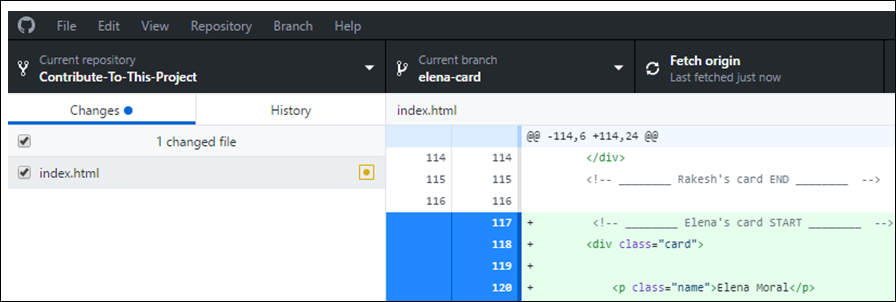
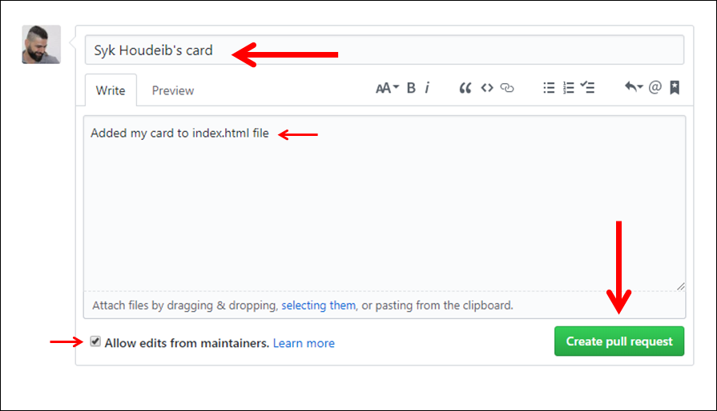

# [Contribute To This Project](https://syknapse.github.io/Contribute-To-This-Project/)

> ## **お知らせ:**
>
> このプロジェクトのメンテナになって、プロジェクトの継続を支援しませんか？ もし興味があれば、[メンテナガイド](../translations/../maintainer_guide/maintainer_guide_japanese.md)を確認して[Twitter](https://twitter.com/Syknapse)にてDMを送ってください。

## はじめに

このチュートリアルは、初めてコントリビュートする人に向けて、シンプルで簡単なプロジェクトに参加できるようにするためのものです。

### 目的

- オープンソースプロジェクトにコントリビュートしよう。
- GitHubの使い方をより快適にしよう。

#### 誰のため？

- このプロジェクトは全くの初心者向けです。アンカータグ``の書き方や編集の仕方がわかっていれば、できるでしょう。
- また、少し経験はあるけれども初めてオープンソースにコントリビュートしたい方やコントリビュートすることで経験や自信をつける方にもおすすめです。

<h5 align="center">なぜコントリビュートするのか</h5>

Web開発者であれば、意欲的だろうと経験豊富だろうと、Gitを使う必要があり、GitHubは誰もが使う最も人気のあるGitホスティングサービスです。また、オープンソースコミュニティの中心地でもあります。GitHubを使いこなすことは必須スキルです。プロジェクトに貢献することで自身がつき、GitHubのプロフィールに記載できるようになります。 
もしあなたがデベロッパーなりたてで、GitとGitHubを学ぶ必要性があるのかどうかを迷っているのであれば、これを見てください: [You Should've Learned Git Yesterday](https://codeburst.io/number-one-piece-of-advice-for-new-developers-ddd08abc8bfa 'New Developer? You should’ve learned Git yesterday. by Brandon Morelli, creator of CodeBurst.io')

<h4 align="center">なにをコントリビュートするのか？</h4>

この[プロジェクトのウェブページ](https://syknapse.github.io/Contribute-To-This-Project/ 'https://syknapse.github.io/Contribute-To-This-Project')に、このようなカードをコントリビュートしてもらいます。カードの中身には、あなたの名前、Twitterのハンドルネーム、簡単な説明、そしてあなたがおすすめするウェブ開発者向けのリンクを3つ掲載します。

HTMLファイルの中に、カードのテンプレートのコピーを作り、自分の情報に置き換えます。

<h4 align="center">目次</h4>

| <ul><li>[はじめに](#はじめに)</li><li>[なにをコントリビュートするのか？](#なにをコントリビュートするのか)</li><li>[セットアップ](#セットアップ-)</li><li>[コントリビュート &rightarrow;](#コントリビュート)</li><li>[次にすること](#次にすること)</li><li>[謝辞](#謝辞)</li></ul> | Contribute: <ul><li>[1. このリポジトリをフォーク](#1-このリポジトリをフォーク)</li><li>[2. リポジトリをクローン](#2-リポジトリをクローン)</li><li>[3. 新しいブランチを作る](#3-新しいブランチを作る)</li><li>[4. index.htmlを開く](#4-indexhtmlを開く)</li><li>[5. カードのテンプレートをコピー](#5-カードのテンプレートをコピー)</li><li>[6. 変更を適用する](#6-変更を適用する)</li><li>[7. 変更をコミット](#7-変更をコミット)</li><li>[8. GitHubにあなたの変更内容を送信](#8-GitHubにあなたの変更内容を送信)</li><li>[9. PRを作成(プルリクエスト)](#9-PRを作成プルリクエスト)</li><li>[10. おめでとう!!](#10-おめでとう)</li></ul> |
| :------------------------------------------------------------------------------------------------------------------------------------------------------------------------------------------------------------------------------------------------------------------------------- | :------------------------------------------------------------------------------------------------------------------------------------------------------------------------------------------------------------------------------------------------------------------------------------------------------------------------------------------------------------------------------------------------------------------------------------------------------------------------------------------------------------------------------------------------------------------------------------------------------------------------------------------------------------------------------------------------------------------------------ |

<h4 align="center">セットアップ! :)</h4>

まず作業をするためのセットアップをしましょう。

1. あなたのGitHubアカウントでログインしてください。もし持っていない場合は[アカウントを作りましょう](https://github.com/join)。 [GitHub Hello World tutorial](https://guides.github.com/activities/hello-world/)をやってからこのセットアップを続けることをおすすめします。
2. [GitHub Desktop](https://desktop.github.com/)をダウンロード。
   - もし[VS Code](https://code.visualstudio.com/ 'Visual Studio Code website')を使っているのであれば、VS Code内で統合されているエディタからGitの操作を行うことができます。
   - しかしながら、このチュートリアルに従う最もシンプルで簡単な方法はGitHub Desktopを使うことです。

<h4 align="center">コントリビュート</h4>

10個の簡単な手順でオープンソースコントリビューターになりましょう。

_所要時間: 30分以内_

<h5 align="center">1. このリポジトリをフォーク</h5>

- ここでの目的は、このプロジェクトのコピーを自身のアカウントに置くことです。
- リポジトリ(リポ)とは、GitHub上のプロジェクトの呼び方で、フォークとはそれをコピーするという意味です。
- [メインページ](https://github.com/Syknapse/Contribute-To-This-Project 'https://github.com/Syknapse/Contribute-To-This-Project')にいることを確認してください。

| <ul><li>_Fork_ ボタンをクリックしてください</li></ul> |  |
| :------------------------------------------- | ----------------------------------------------: |

- これでこのプロジェクトの完全なコピーがあなたのアカウントにあることを確認できるでしょう。

---

<h5 align="center">2. リポジトリをクローン</h5>

- ここでの目的は、プロジェクトのローカルコピーを作成していくことです。これは自分のPCにコピーを作るという意味です。
- GitHub Desktopを開いてください。 そのアプリで

| <ul><li>_File_ をクリックし、 _Clone repository_ クリック</li></ul> |  |
| :-------------------------------------------------------- | -------------------------------------------------------: |

| <ul><li>あなたのGitHubにあるプロジェクトとフォークされたプロジェクトが見れるでしょう。</li><li>`<あなたのGitHubユーザ名>/Contribute-To-This-Project`を選択してください。</li><li>_Clone_ をクリックしてください。</li></ul> |  |
| :-------------------------------------------------------------------------------------------------------------------------------------------------------------------- | :----------------------------------------------------------------------------------------------------------: |
| <ul><li>フォークされたプロジェクトは、左側にフォークのアイコンが表示されます。</li><li>フォークにはあなたのGitHubユーザ名がつきます。</li></ul>                                      |        |

- プロジェクトがハードディスクにコピーされるため、しばらく時間がかかるでしょう。デフォルトのパスは`..\Documents\GitHub`のままにしておくことをおすすめします。
- これでプロジェクトのローカルコピーができました。

---

<h5 align="center">3. 新しいブランチを作る</h5>

- リポジトリをクローンして、GitHub Desktopでそれを開いたら、新しいブランチを作成しましょう。
- ブランチとは、`master`と呼ばれるプロジェクトのメインブランチから自分の変更したものを切り離しておくための方法です。例えば、何かしらの変更を別のブランチで行っていて、変更に満足できなかったときはそのブランチを削除するだけで、メインプロジェクト(`master`)に影響を与えることはありません。

| <ul><li>_Current branch_ をクリック</li><li>そして _New_ をクリック</li></ul> |  |
| :---------------------------------------------------------------------- | ---------------------------------------------------------------------------: |

| <ul><li>ブランチに名前をつけましょう</li><li>`Create branch`をクリック</li></ul> |  |
| :---------------------------------------------------------------------- | -------------------------------------------------------------: |

- ブランチには好きな名前をつけることができますが、ここでの目的は自分の名前のカードを追加するためのブランチなので、`あなたの名前-card`と呼ぶと、このブランチの意図が明確になり、よい練習になるでしょう。

| <ul><li>新しいブランチをGitHubに公開する</li></ul> |  |
| :-------------------------------------------------- | ------------------------------------------------------------------------------------------------------------------: |

- これで、`master`とは別の新しいブランチを作成することができました。
- 次のステップでは、このブランチで作業していることを確認してください。GitHub Desktopの中央上部にある _Current branch_ に現在のブランチの名前が表示されています。

**`master`ブランチでは作業しないでください**

---

<h5 align="center">4. index.htmlを開く</h5>

- これから編集するファイルをお好みのコードエディタで開いてください。
- あなたのPCにコピーされたプロジェクトがあるフォルダを探してください。デフォルトだと`あなたのPC > Documents > GitHub > Contribute-To-This-Project`にあるでしょう。
- `index.html`は`Contribute-To-This-Project`フォルダ直下にあります。

| <ul><li>あなたの好きなコードエディタ(Sublime, VS Code, Atom..etc)を開き、`ファイルを開く`コマンドを使い、index.htmlファイルを開いてください。</li><li>または、ハードディスクにあるファイルを右クリックし、エディタで開くこともできます。</li></ul> |  |
| :--------------------------------------------------------------------------------------------------------------------------------------------------------------------------------------------------------------------------------------------------------------------------------- | -----------------------------------------------------------------------------------: |

- これで編集するファイルをエディタで開き、更新する準備ができました。

---

<h5 align="center">5. カードのテンプレートをコピー</h5>

- カードのテンプレートをコピーして、作業を開始します。

| <ul><li>htmlファイルの先頭の`<head>`と`<header>`セクションの下に`== TEMPLATE ==`というラベルのついたセクションを見つけることができます。</li><li>画像の赤い四角の中にある、`Contributor card START`のコメントから`Contributor card END`のコメントまでの全てをコピーします</li></ul> |
| :---------------------------------------------------------------------------------------------------------------------------------------------------------------------------------------------------------------------------------------------------------------------------------------- |
|                                                                                                                                                                                                                  |

| <ul><li>`Paste YOUR CARD directly BELOW this line`コメントの直下にコピーした内容を貼り付けます。</li><li>貼り付けたカードの最初の上と最後の下に1行のスペースがあることを確認してください。コードをできる限り分かりやすくすることはいい練習です。</li><li>リンターやフォーマッターは絶対に使用しないでください。このプロジェクトではPrettierの設定がされています。</li></ul> |
| :------------------------------------------------------------------------------------------------------------------------------------------------------------------------------------------------------------------------------------------------------------------------------------------------------------------------- |
|                                                                                                                                                                                                                                         |

- このカードは**あなた**が編集するためのものです。

---

<h5 align="center">6. 変更を適用する</h5>

- これからhtmlの編集を行い、カードのカスタマイズ可能なフィールドを変更していきます。

| <ul><li>'Name'をあなたの名前に変更しましょう</li><li>重要: `class="name"`は変更しないでください</li></ul> |  |
| :---------------------------------------------------------------------------------------- | -----------------------------------------------------------: |

| <ul><li>あなたのTwitterアカウントのURLを入れましょう`href="Insert URL here"`</li><li>あなたのハンドルをテキストフィールドに入れてください</li></ul> |
| :--------------------------------------------------------------------------------------------------------------------------- |
|                |

- Twitter以外を使う場合は、Twitterアイコン`<i class="fa fa-x-twitter"></i>`を別のものに置き換えましょう。[Font Awesome Icons](http://fontawesome.io/icons/)で置き換えるものを検索して、`fa-x-twitter`を別のものに置き換えてください。例えばfacebookの場合は、`fa-facebook`です。その後上記と同じ手順を踏んでください。

| <ul><li>あなたについて教えてください</li><li>短くまとめてください。ブログの記事というより、つぶやきのように考えてください。</li></ul> |  |
| :------------------------------------------------------------------------------------------------------------------------------- | -------------------------------------------------------------------------: |

| <ul><li>Web制作に役立つようなリソースへのリンクを3つ選んでください。</li><li>これはなんでもいいです。動画、トーク、ポッドキャスト、記事、参考文献、ツールなど。</li><li>あなたが初心者でも安心してください。基礎的なことでも、知っていることを教えてください。御毒ほど多くの人が恩恵を受けることでしょう。</li></ul> |
| :------------------------------------------------------------------------------------------------------------------------------------------------------------------------------------------------------------------------------------------------------------------------------------------------------------------------------------------------------------------ |
|                                                                                                                                                                                                                                    |
| <ul><li>リンク: `href="here"`に、`#`を置き換えて入力してください</li><li>タイトル: `title="here"`に簡単なタイトルを書いてください</li><li>名前: `>here</a>`にリソースの名前をテキストフィールドに入力してください</li></ul>                                                                                                                                                               |

- 変更内容を**すべて保存した**ことを確認してください。
- **変更内容をテストしてください**。 これは特に重要です！htmlファイルをブラウザで開き(ダブルクリックで開けます)、あなたのカードがどのように見えるかを確認してください。ページ全体を見て何も壊れていないことと、あなたのリンクがクリックしてちゃんと動作していることを確認します。コンソールを開き(Ctrl + Shift + J (Windows / Linux) または Cmd + Opt + J (Mac))、エラーメッセージがないことを確認します。
- さて、これでコードの編集が完了しました！次は変更をコミットし、メインプロジェクトにマージするためにGitHubへ変更内容を送信します。

---

<h5 align="center">7. 変更をコミット</h5>

- GitHub Desktopに戻ります。
- あなたが変更したファイルがステージングエリアに追加されていることを確認できるでしょう。
- これはGitがすべての変更点を記録していることを意味します。
- アプリに反映されているのがわかると思います。追加したものは緑色で表示され、削除したものは赤色で表示されます。

| <ul><li>次は _Commit_ というものを行います</li><li>この意味は大まかにいうと、変更を確認する、という意味です</li></ul> |  |
| :-------------------------------------------------------------------------------------------------- | ---------------------------------------------------------------------------------------------------------------------------------------------------------------------------: |

| <ul><li>GitHub Desktopのヘッダーはこのようになっているでしょう</li><li>`Current Repository`のプロジェクト名の横にあるフォークのアイコンに注目してください</li><li>あなたの`Current branch`が手順3で行ったブランチ名になっていることを確認できるでしょう</li></ul> |
| :-------------------------------------------------------------------------------------------------------------------------------------------------------------------------------------------------------------------------------- |
|                                                |

| <ul><li>_Commit_ するには _Summary_ フィールドを埋める必要があります</li><li>これはあなたが何を変更したかを説明するコミットメッセージです</li><li>ここでは"Add my card information"(私のカード情報を追加)が分かりやすいでしょう</li><li>任意でより細かい _説明_ を追加することができます</li><li>_Commit_ ボタンをクリックしてください。ボタンが`Commit to "あなたのブランチ名"`となっているでしょう。</li></ul> |  |
| :------------------------------------------------------------------------------------------------------------------------------------------------------------------------------------------------------------------------------------------------------------------------------------------------------------------------------------------------------------------------------------- | -------------------------------------------------------------------------------------------------------------------------------------------: |

---

<h5 align="center">8. GitHubにあなたの変更内容を送信</h5>

- これで変更内容が保存され、コミットされました。しかしこれらはローカルのみに保存されています。つまりあなたのPCだけにしかありません。
- ローカルの変更をGitHubにあるリポジトリと同期させる操作のことを _Push_ といいます。ローカルリポジトリの変更をGitHub上のリモートリポジトリに「プッシュ」しているのです。

| <ul><li>_Push_ ボタンをクリックしてください</li></ul> |  |
| :---------------------------------------- | ------------------------------------------------------------------------------------------------: |

- 数秒後に操作が完了し、このブランチのコピーがローカルとGitHub上に存在することになります。

---

<h5 align="center">9. PRを作成(プルリクエスト)</h5>

- いよいよです。_プルリクエスト_ を作成しましょう。
- 現時点ではあなたが行ったすべての作業は、あなたのGitHubにあるフォークで行われています。
- さて、いよいよメインプロジェクトに変更を送り、マージしてもらいましょう。
- この操作のことを [_プルリクエスト_](https://help.github.com/articles/about-pull-requests/ 'About Pull Requests - GitHub Help') といいます。なぜなら、あなたはメインプロジェクトのメンテナに、あなたの変更を彼らのプロジェクトへ「取り込む」ように依頼するからです。
- **あなた**がフォークしたプロジェクトのページに行ってください。(フォークのアイコンとあなたの名前が上部に表示されているでしょう)
- リポジトリの上部にハイライトされたプルリクエストのメッセージと緑色のボタンが表示されています。

| <ul><li>`Compare and pull request`をクリックしてください</li></ul> |  |
| :-------------------------------------------------------- | ------------------------------------------------------------------------------------------------------------------------------------------------------------------: |

| <ul><li>`Open a pull request`ページはこのように表示されているでしょう。</li><li>確認してください _このブランチはフォークの`master`ブランチに対してではなく、元のプロジェクトに対してマージしようとしています_。</li><li>以下の画像はプルリクエストのヘッダーです。</li><li>左側が元のプロジェクトの`master`ブランチで、右側はあなたのフォークであり、あなたのブランチです。</li></ul> |
| :----------------------------------------------------------------------------------------------------------------------------------------------------------------------------------------------------------------------------------------------------------------------------------------------------------------------------------------------------------------------------------------------------------------------------------------- |
|                                                                                                                                                                                                                                                                       |

| <ul><li>プルリクエストを作成してください。</li><li>タイトルを入力してください</li><li>任意の情報を概要欄に入力してください</li><li>`Create pull request`をクリックしてください</li></ul> |  |
| :----------------------------------------------------------------------------------------------------------------------------------------------------- | -----------------------------------------------------------------------------------------------------: |

- やることの多さに混乱せずとも大丈夫です。とりあえずこの3つをやっておけば大丈夫です。
- `Allow edits from maintainers`はチェックを入れたままにしてください。
- これでプロジェクトのメンテナに _プルリクエスト_ が送られました。レビューされて承認されると、あなたの変更が[プロジェクトのウェブページ](https://syknapse.github.io/Contribute-To-This-Project 'Contribute To This Project web page')に表示されます。

---

<h5 align="center">10. おめでとう!!</h5>

完了です。おめでとうございます！
これでGitHubのオープンソースにコントリビュートできました。

あなたのコードがウェブページに追加されました: [https://syknapse.github.io/Contribute-To-This-Project](https://syknapse.github.io/Contribute-To-This-Project)

あなたの変更は**即時に反映はされません**。まず初めにレビューされ、許可、マージの順番でプロジェクトのメンテナによって行われます。マージされるとあなたのカードがウェブページ上で確認できるでしょう。

レビュアーがプルリクエストに変更を求めるのはごく普通のことです。いずれ自身の身に降りかかるでしょうし、いい練習になると考えてください。コメントや要求された変更には目を通してください。要求された変更を行ったら(ブランチに戻ったら)、あとはコミットして変更をプッシュするだけです。PRは自動的に新しい変更を検知して更新してくれます。

私はできる限り早くレビューとマージを行うことを約束しますが、空いている時間で行うため、数日の遅れが発生するかもしれません。

---

---

<h4 align="center">次にすること</h4>

- しばらくしたら、マージされたプルリクエストを確認しに来てください。
- あなたの変更が許可、変更が要求、または最終的にマージされてあなたのカードが追加されたとき、GitHubからメールが来るでしょう。
- もしこのプロジェクトが**役に立つ**と思われたら、ぜひ評価をお願いします。プロジェクトの上部にある:star: star :star:または**ツイート**して世界中に広めてください 
- 私を[Twitter](https://twitter.com/Syknapse '@Syknapse')で**フォロー**または[それ以外](https://syknapse.github.io/Syk-Houdeib/#contact 'My contact section | Portfolio')でお気軽にお問い合わせください
- このプロジェクトはオープンソースプロジェクトなので、カードを追加するだけではなく、バグの修正や改善、新機能の追加にコントリビュートすることが歓迎されています。[issue](https://help.github.com/articles/creating-an-issue/ 'Mastering Issues | GitHub Guides')を作成するか、新しい[pull request](https://help.github.com/articles/creating-a-pull-request-from-a-fork/ 'Creating a pull request from a fork | GitHub Help')を作成してください。
- コミュニティをより良くするために、GitHubの[Discussions](https://github.com/Syknapse/Contribute-To-This-Project/discussions)を確認してください。プルリクエストの隣にあるタブです。ここでは自己紹介やオープンソースプロジェクトに関する深い議論、プロジェクトのメンテナーとのコミュニケーションの場です。この機能を作り上げて私たちのコミュニティを強化することに協力していただけませんか？
- **このプロジェクトにコントリビュートしていただき、ありがとうございます**。これで他のプロジェクトにコントリビュートできるようになりました。で初心者歓迎でコントリビュートできるものを探してみてください。
- また、PRのレビューやマージに手を貸してくれる協力者も募集しています。もし、もっと高度なGitの練習をしたいのであれば、Twitterで私にDMを送って、[メンテナガイド](../maintainer_guide/maintainer_guide_japanese.md)を読んでください。

<h4 align="center">謝辞</h4>

このプロジェクトは、[Roshan Jossey's](https://github.com/Roshanjossey)の優れたチュートリアルを持つ[first-contributions](https://github.com/Roshanjossey/first-contributions)に強く影響を受けています。

また、特に[#GoogleUdacityScholars](https://twitter.com/hashtag/GoogleUdacityScholars?src=hash)を取り巻く素晴らしいコミュニティに触発されています。The Google Challenge Scholarship: Front-End Web Dev, class of 2017 Europe.

<h4 align="center">プロジェクト情報</h4>

<h4 align="center">プルリクエスト情報:</h4>

<h4 align="center">メンテナ達</h4>

[トップへ戻る &uparrow;](#はじめに)
